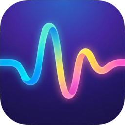

  

<h1 align="center">Wave</h1>

Local voice-to-text for your Mac. 
Press a shortcut, speak, paste. No cloud, no API keys, no subscriptions.

<strong>Version 0.4.1</strong> · macOS 14+ · Apple Silicon & Intel

<a href="https://github.com/madebysan/wave-mac/releases/latest"><strong>Download Wave</strong></a>

Also available for <a href="https://github.com/madebysan/wave-ios"><strong>iOS</strong></a>

---

Wave is a menu bar voice-to-text app that runs entirely on your Mac. Press a shortcut, speak, and the transcribed text pastes into whatever app you're in. Powered by [WhisperKit](https://github.com/argmaxinc/WhisperKit) on the Apple Neural Engine, so your audio never leaves the machine.

## How it works

1. Press **Option+Space** (or your custom shortcut)
2. Speak. A floating preview shows your words in real time.
3. Press the shortcut again (or click the menu bar icon) to stop.
4. Transcribed text gets pasted into the active app.

## Features

- **Works in any app.** Text pastes wherever your cursor is (TextEdit, Notes, Slack, browser, VS Code).
- **Real-time preview HUD** showing confirmed and tentative text as you speak.
- **Push-to-talk or toggle.** Hold the shortcut to record and release to transcribe, or tap twice.
- **Language auto-detection** or pick one of 99 supported languages explicitly.
- **Transcription quality controls.** Smart filler removal (strips "um", "uh", stutters, context-aware fillers like "basically" and "sort of"), auto-punctuation from Whisper, and a 1-second trailing buffer so your last words aren't clipped.
- **Session behavior.** Optional silence auto-stop (30s to 10 min or never), sound cues when recording starts / stops, and auto-mute for system audio so YouTube or music doesn't interfere.
- **Model selection.** Base, small, medium, or large Whisper variants.
- **Audio file import.** Drop in existing MP3 / WAV / AIFF / OGG / FLAC files to transcribe.
- **Transcription history.** Search and export past transcriptions.
- Configurable global shortcut, launch-at-login, lives in the menu bar.

## Install

1. Download `Wave.dmg` from the [latest release](https://github.com/madebysan/wave-mac/releases/latest)
2. Open the DMG and drag **Wave** to Applications
3. Launch from Applications
4. Grant **Microphone** and **Accessibility** permissions when prompted
5. The Whisper model (~460MB) downloads automatically on first launch

## Permissions

| Permission | Why |
|-----------|-----|
| Microphone | Records your voice for transcription |
| Accessibility | Pastes transcribed text into the active app via simulated Cmd+V |

## Tech stack

- Swift + AppKit (native macOS menu bar app)
- [WhisperKit](https://github.com/argmaxinc/WhisperKit) for Core ML-optimized Whisper inference
- [KeyboardShortcuts](https://github.com/sindresorhus/KeyboardShortcuts) for global hotkey management
- No sandbox (required for the Accessibility API and global hotkeys)

## Feedback

Found a bug or have a feature idea? [Open an issue](https://github.com/madebysan/wave-mac/issues).

## License

[MIT](LICENSE)

---

Made by [santiagoalonso.com](https://santiagoalonso.com)
